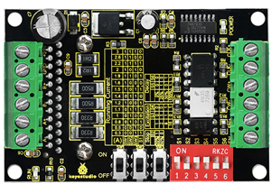
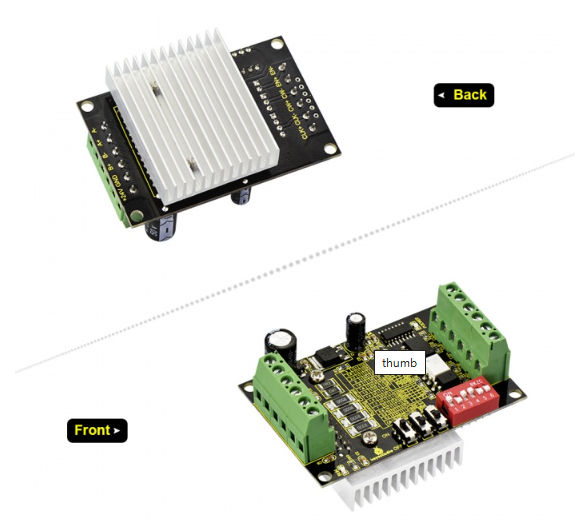
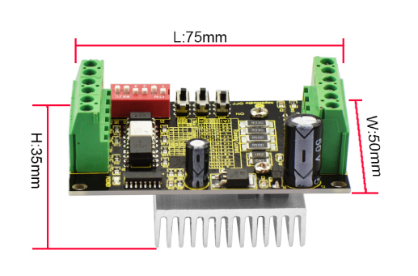
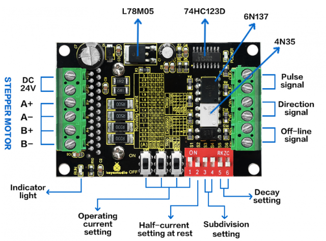
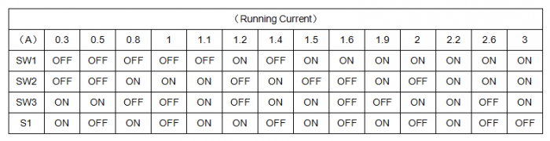
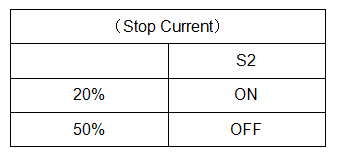
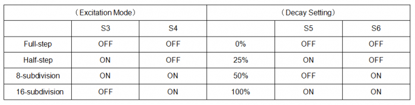
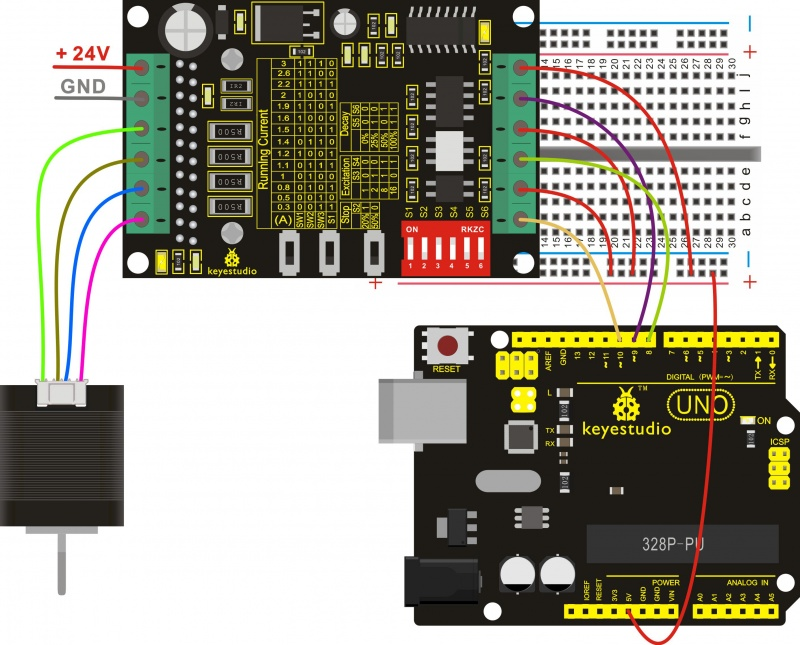
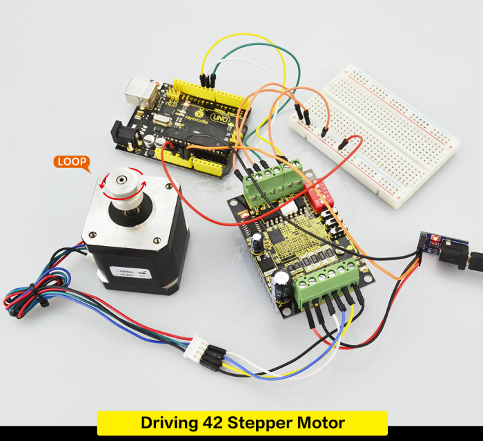

# KS0318 keyestudio Tb6560 Stepper Motor Drive Board



## 1. Introduction

This keyestudio board mainly uses the TB6560 stepper motor driver, which is an economical stepper motor driver with high stability, reliability and immunity. It can be applied to various industrial control environments.

This driver is mainly used to drive Type 35, 39, 42, 57 with 4, 6 and 8-wire two-phase hybrid stepper motors. It has 4 kinds of subdivisions and the maximum is up to 16-subdivision. The driving current is within 0.3A-3A, and output current has a total of 14 modes, and current resolution is about 0.2A. It has the function of automatic half-current, low-voltage shutdown for over-current protection and over-temperature shutdown.



## 2. Specification

- Supply Voltage: DC 8-35V, DC 24V recommended
- Driving Current: 0.3-3A
- Current Resolution: 0.2A
- Driver Support: Type 35、39、42、57 with 4、6、8-wire two-phase hybrid stepper motors
- Max Exciation: 16-subdivision
- Dimensions: 75mm * 50mm * 35mm



## 3. Pinout Guide and Settings



|         Driver          |                    Operating Instructions                    |
| :---------------------: | :----------------------------------------------------------: |
| Running current setting | Using four dial switches SW1, SW2, SW3, S1 to set the driver output current, with total 14 modes of output current. |
|  Stop current setting   | User can set the automatic half-current of driver via S2.“1”means that Stop current is set as 20% of running current; “0”means that Stop current is set as 50% of running current. In general, should set S2 as “1” to reduce the heat generated by the motor and driver, thus improve the reliability. |
|   Excitation setting    | Use S3-S4 to set the driver subdivisions, with total 4 modes of subdivision. First should stop the driver running before setting the subdivision. |
|      Decay setting      | Use S5-S6 to set the Decay mode, with total 4 modes of decay. Choose different Decay modes to get the better drive effect. |
|    Signal connector     | CLK+ / CLK- : positive and negative terminal of pulse control signal;CW+ / CW- : positive and negative terminal of direction signal ENA+ / ENA- : positive and negative terminal of enable signal |
|     Motor connector     | A+ and A- are connected to the positive and negative terminal of stepping motor A-phase winding;B+ and B- are connected to the positive and negative terminal of stepping motor B-phase winding; If A-phase and B-phase winding are swapped, motor direction will be reversed. |
|     Power connector     | DC current for power supply; supply voltage range of DC 8-35V, 24V DC power supply recommended. Recommend to use 24V/5A switching power supply. |
|     Indicator light     | POWER indicator is always on when driver is powered up. RUN indicator: The brightness of this indicator will vary with the running speed of motor. The faster the motor runs, the brighter the indicator light. When motor stops, indicator will be always on or off. |

## 4. Setting Method

- 1. With 6 input terminals, can be easily connected to the input form of Common anode or Common cathode.
- 2. The level of input pulse is 5V. If it is 12V level pulse, need to connect a 1K resistor; if it is 24V level pulse, need to connect a 2.4K resistor.
- 3. CLK terminal has pulse, motor runs; if no pulse, it will automatically enter half-current mode to lock the motor.
- 4. CW terminal is low level or floating, motor turns in forward; if high level, motor turns in reverse.
- 5. EN terminal is low level or floating, in working mode; if it is high level, in off-line state.







**Note:**

- 1. It is necessary to check the wiring repeatedly before powered up, or else the wrong wiring may burn out the chip!
- 2. The setting current should not exceed the rated current of motor.

## 5. Wiring Diagram



## 6. Sample Code

Code download:   [Resources](./Resources.7z)

```c
//common anode connection, active Low level for control pin.
//EN+ CW+ CLK+5V connected to controller
const int EN = 10;
const int CLK = 9;
const int CW = 8;
int Distance = 0; // Record the number of steps we've taken 
void setup() 
{
  pinMode(CW, OUTPUT);
  pinMode(CLK, OUTPUT);
  pinMode(EN, OUTPUT);
  digitalWrite(CW, LOW);
  digitalWrite(CLK, LOW);
  digitalWrite(EN, HIGH);
}

void loop() 
{
  digitalWrite(EN, HIGH);//High level or enable pin floating, turn off Low level. 
  digitalWrite(CLK, HIGH);
  delayMicroseconds(100);
  digitalWrite(CLK, LOW);
  delayMicroseconds(100);
  Distance = Distance + 1; // record this step // Check to see if we are at the end of our move
  // two rotation for 1/8 bridge and 1 rotation for 1/6 bridge (for this code)
  if (Distance == 3200) // We are! Reverse direction (invert DIR signal)
  { 
    if (digitalRead(CW) == LOW) 
    {
    	digitalWrite(CW, HIGH); 
    }
    else 
    {
      digitalWrite(CW, LOW);
    } 
    // Reset our distance back to zero since we're // starting a new move
  Distance = 0; // Now pause for half a second delay(500);
  }
}
```

## 7. Test Result

In the experiment, we connect the Tb6560 stepper motor drive board to UNO R3 board to drive a 42 stepper motor turn a round clockwise and counter-clockwise, loop alternately. It uses Common anode connection, and input pulse level is 5V. The current is set as 1.2A, and Stop Current is set as 50% of running current. Operating subdivision is 8-subdivision, and Delay setting is 0%.

